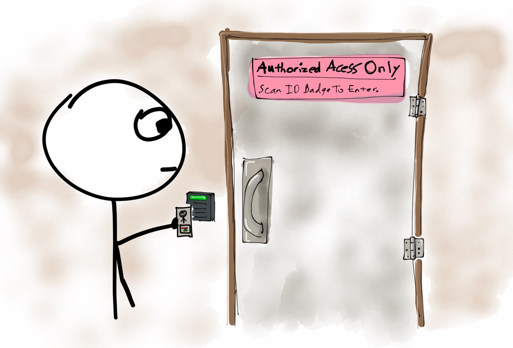

# MustBe: Authorization Plumbing For NodeJS / Express Apps



MustBe is not a complete authorization framework, with roles
and responsibilities and models and data access and everything
that you need. Rather, it is the underlying plumbing that you
need to secure your site. It allows you to fill in the 
necessary parts to manage data access, roles and users, and
gives you the activity based plumbing to secure it all. 

## Authorization, Not Authentication

MustBe is an authorization system - the part of a security system
that decides whether or not you are allowed to do something. This
is the second of authentication and authorization, where authentication
simply determines who you are. 

Specifically, MustBe is an activity based authorization system. It
allows you to verify that a user has permissions to perform any
given activity in your application.

## What Is Activity Based Authorization?

The gist of it is that you check whether or not a user
has permission to perform an activity. How they get permission
to do that activity is up to you. Maybe it's throug a role,
maybe it's through data they have been assigned to. But the
permission for the activity is what needs to be checked.

For more detail on this, check out 
[my 2011 article on using activity based authorization checks](http://lostechies.com/derickbailey/2011/05/24/dont-do-role-based-authorization-checks-do-activity-based-checks/). 
It will give you the core of what you need to know about
whey role-based authorization checks are a bad idea, and why
activity based permissions are the way to go. 

## Documentation

Detailed documentation about the configuration and use of
MustBe can be found in the [documentation folder](docs).

* [Core Configuration](docs/configure.md)
* [Autorizing Express Routes](docs/authorize-routes.md)
* [Using As Express Middleware](docs/middleware.md)
* [Custom Identities](docs/custom-identities.md)

## Getting Started

The first thing you need to do is install MustBe, and
save it to your package.json file.

`npm install --save mustbe`

### Configure Once In Your App

In your app.js (or whatever bootstraps your app), require
the MustBe module, and also bring in a mustbe-config module
which you will define in a moment. 

Call the `.config` method
on the `mustBe` object, and pass in the function that is
exported from the config module.

```js
// app.js

var mustBe = require("mustbe");
var mustBeConfig = require("./mustbe-config");
mustBe.configure(mustBeConfig);
```

### Create The Configuration

Now you can create a `mustbe-config.js` file for your application.
Having the config file separate from the `app.js` bootstrapper
file helps to keep things clean.

Open the `mustbe-config.js` file and build your configuration.
Provide configuration for your user identity, route helpers, 
activities and/or overrides.

Here is a basic configuration example from which you can start:

```js
// ./mustbe-config.js
var mustBe = require("mustbe");
module.exports = function(config){

  config.routeHelpers(function(rh){
    // get the current user from the request object
    rh.getUser(function(req, cb){
      // return cb(err); if there is an error
      cb(null, req.user);
    });

    // what do we do when the user is not authorized?
    rh.notAuthorized(function(req, res, next){
      res.redirect("/login?msg=you are not authorized");
    });
  });

  config.activities(function(activities){
    // configure an activity with an authorization check
    activities.can("view thing", function(identity, params, cb){
      var id = params["id"];
      someLib.anotherThing(id, function(err, thing){
        if (err) { return cb(err); }
        var hasThing = !!thing;
        cb(null, hasThing);
      });
    });
  });

};
```

Now you can run the `mustBe` functions on your routes.

```js
var mustbe = require("mustbe").routeHelpers();
var express = require("express");

var router = express.Router();
router.get("/:id", mustBe.authorized("view thing", view));

function view(req, res, next){
  res.render("/something");
}
```

Be sure to read the full documentation, linked above, for the
complete set of options and methods that can be called to
configure and use MustBe.

## Legal Junk

MustBe is Copyright 2014 Muted Solutions, LLC. All Rights Reserved.

Distributed under [MIT License](http://mutedsolutions.mit-license.org).
